# 🛒 MyStore - Flutter E-Commerce App

A modern, feature-rich e-commerce mobile application built with **Flutter**, following **Clean Architecture** and the **Bloc** state management pattern.

## 📸 Screenshots

| Onboarding (1/3) | Onboarding (2/3) | Onboarding (3/3) |
|:---:|:---:|:---:|
| 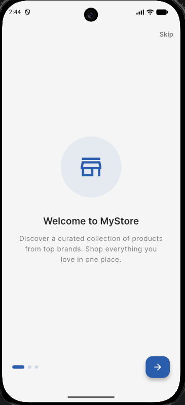 | 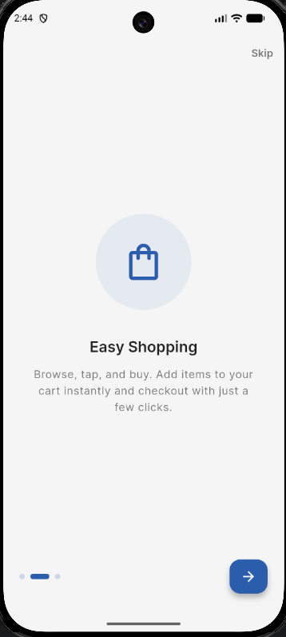 | 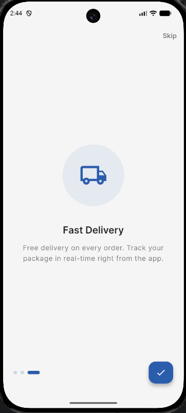 |

| Home (Light) | Home (Dark) | Product Detail |
|:---:|:---:|:---:|
| 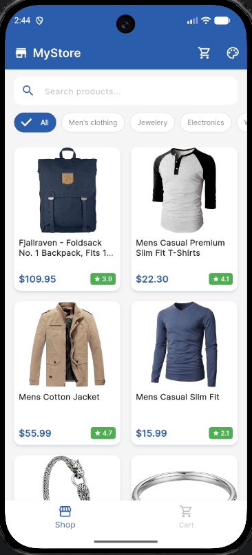 | 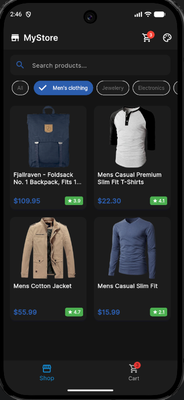 | 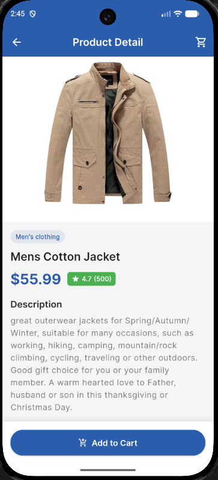 |

| Detail (Scrolled) | Cart (Light) | Cart (Dark) |
|:---:|:---:|:---:|
| 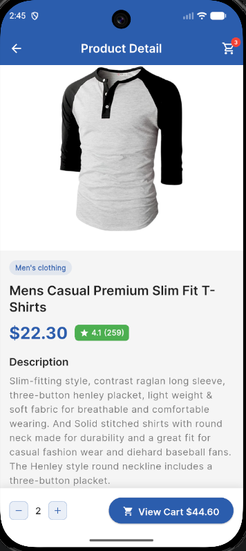 | 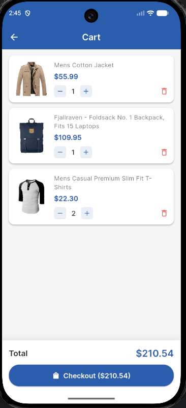 | 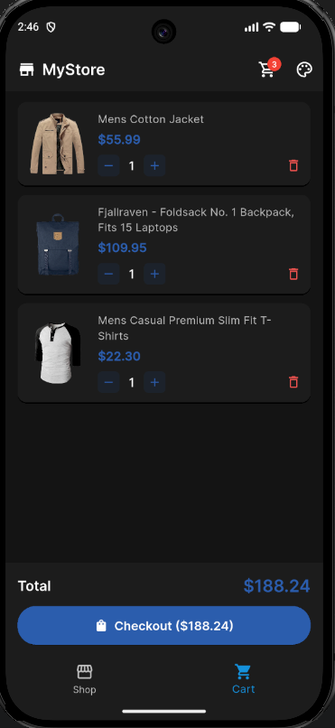 |

| Checkout (Light) | Checkout (Dark) | Order Placed |
|:---:|:---:|:---:|
| 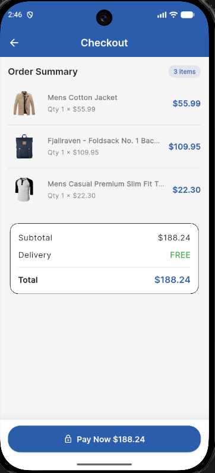 | 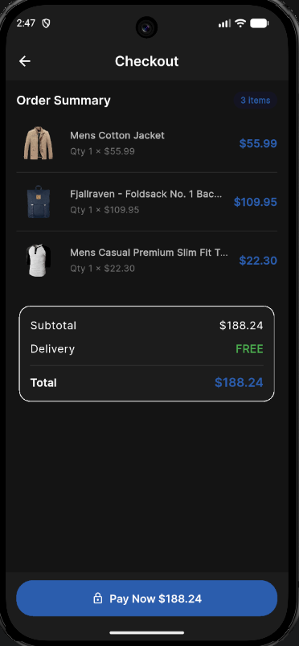 | 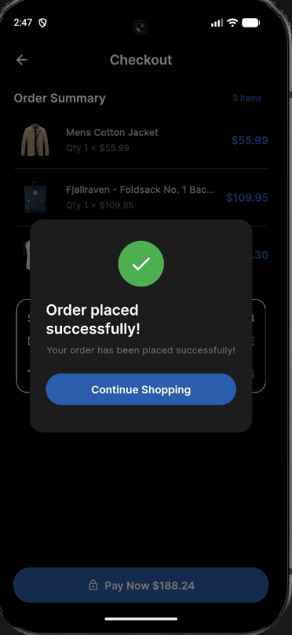 |

## ✨ Features

- **Product Listing** — Grid view with search bar and category filter chips
- **Product Detail** — Full product info with Hero animation, quantity increment/decrement, and live line total
- **Cart Management** — Persistent cart using SQLite with quantity controls and total calculation
- **Checkout** — Order summary with item list, total price card, and Pay Now button
- **Dark / Light Theme** — Toggle via drawer with persistent preference
- **Onboarding** — 3-page intro shown only on first launch (SharedPreferences)
- **Pull-to-Refresh** — Refresh product listings from API
- **Cart Badge** — Live item count on the app bar
- **Responsive Grid** — Adapts layout for different screen sizes

## 🏗 Architecture

```
lib/
├── app/
│   └── home_page.dart              # Main shell with bottom nav & drawer
├── core/
│   ├── di/
│   │   └── service_locator.dart    # GetIt DI registrations
│   └── theme/
│       ├── app_theme.dart          # Light/dark theme definitions
│       └── theme_cubit.dart        # ThemeMode cubit
├── features/
│   ├── cart/
│   │   ├── bloc/                   # CartBloc & CheckoutBloc
│   │   ├── data/
│   │   │   ├── datasource/        # SQLite local data source
│   │   │   ├── model/             # CartItem model
│   │   │   └── repository/        # CartRepository
│   │   └── presentation/
│   │       ├── screens/           # CartPage, CheckoutPage
│   │       └── widgets/           # Cart item card
│   ├── onboarding/
│   │   └── presentation/
│   │       └── screens/           # OnboardingScreen (3 pages)
│   └── product/
│       ├── bloc/                   # ProductBloc
│       ├── data/
│       │   ├── datasource/        # Remote data source (HTTP)
│       │   ├── model/             # Product model
│       │   └── repository/        # ProductRepository
│       └── presentation/
│           ├── screens/           # ProductListPage, ProductDetailPage
│           └── widgets/           # ProductCard, CategoryChips, SearchBar
└── main.dart                       # Entry point, routes, BlocProviders
```

## 🧰 Tech Stack

| Technology | Purpose |
|-----------|---------|
| **Flutter** (SDK ^3.11.5) | Cross-platform UI framework |
| **Dart** | Programming language |
| **Bloc / flutter_bloc** ^9.1.0 | State management |
| **GetIt** ^8.0.3 | Dependency injection |
| **http** ^1.2.2 | HTTP client for API calls |
| **sqflite** ^2.4.1 | Local SQLite database for cart |
| **SharedPreferences** ^2.3.4 | Key-value storage (onboarding seen flag) |
| **cached_network_image** ^3.4.1 | Image caching & loading |
| **shimmer** ^3.0.0 | Loading skeleton effect |
| **google_fonts** ^6.2.1 | Inter font family |
| **equatable** ^2.0.7 | Value equality for Bloc states/events |
| **flutter_launcher_icons** ^0.14.3 | App icon generation |

## 🌐 API

Uses **[FakeStoreAPI](https://fakestoreapi.com/)** for product data:

| Endpoint | Description |
|----------|-------------|
| `GET /products` | Fetch all products |
| `GET /products/categories` | Fetch category list |
| `GET /products/category/{name}` | Filter by category |

## 🚀 Getting Started

### Prerequisites

- Flutter SDK ^3.11.5 — [Install Flutter](https://docs.flutter.dev/get-started/install)
- Android Studio / Xcode / VS Code

### Clone & Run

```bash
# Clone the repository
git clone https://github.com/Rayarmohan/MyStore.git

# Navigate to project
cd MyStore

# Install dependencies
flutter pub get

# Generate app icons (optional)
dart run flutter_launcher_icons

# Run the app
flutter run
```

### Build APK

```bash
flutter build apk --release
```

### Build iOS

```bash
flutter build ios --release
```
